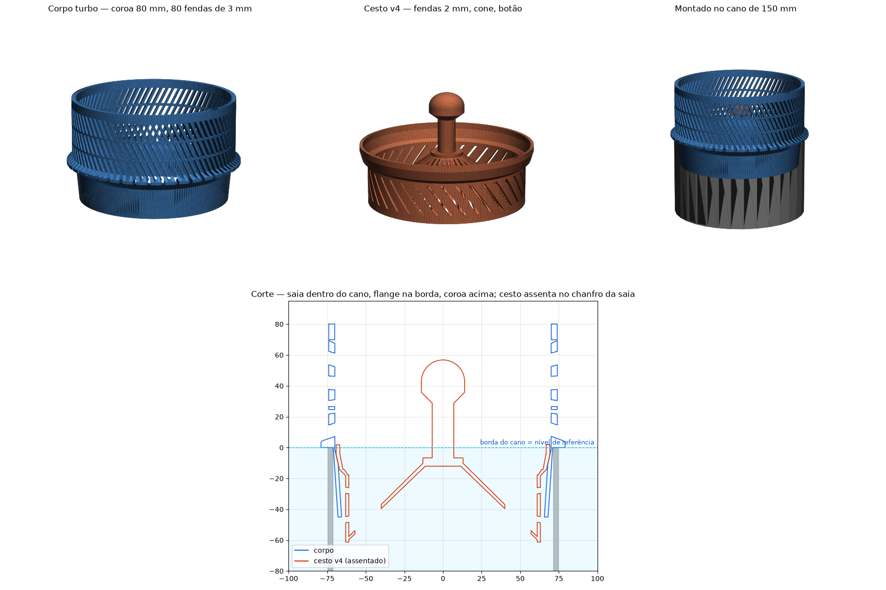
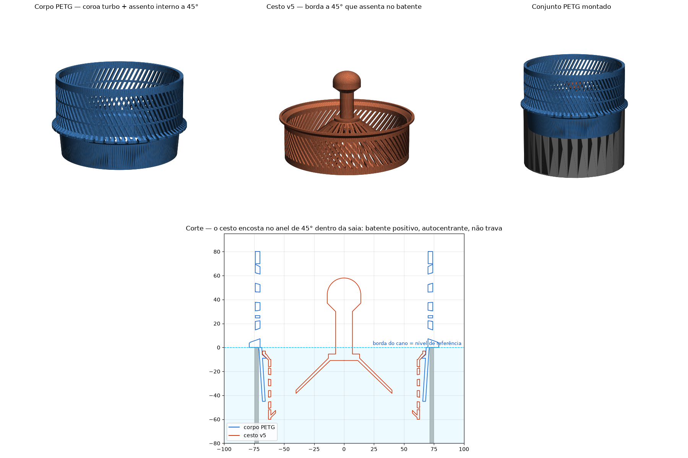
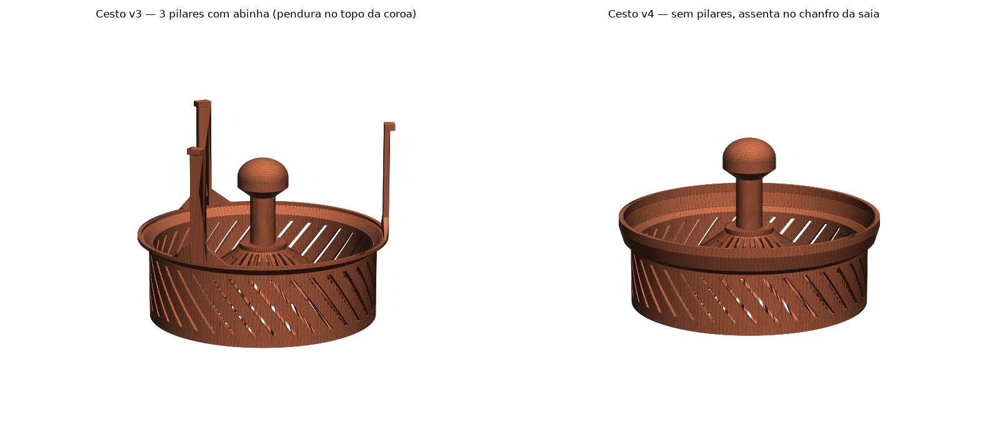

# pond-skimmer

Skimmer de lago impresso em 3D para **cano de PVC de esgoto de 150 mm**
(externo 149–151, interno 143–145, parede 3 mm), com **barreira de peixes de
3 mm** e cesto removível. Tudo é gerado por script paramétrico em Python
(`manifold3d`), sem CAD manual.

> O ponto de partida foi um "Pond skimmer" para cano de 110 mm publicado no
> MakerWorld (arquivo `.3mf`, só malhas). O conceito — corpo ranhurado + cesto
> interno removível — é dele; a geometria aqui é toda nova. O `.3mf` original
> não está neste repo.



*Corpo turbo e cesto v4, e o corte montado no cano de 150 mm (z = 0 é a
borda do cano). Figuras geradas dos STLs por `tools/render.py`.*

## Peças (estado atual)

Os STLs ficam em **pastas por versão** (`stl/v1.0-instalado/`, `stl/v2.0-petg/`);
cada pasta é um conjunto que encaixa entre si — ver [stl/README.md](stl/README.md).

| Arquivo | O que é | Status |
|---|---|---|
| `stl/v1.0-instalado/corpo150_turbo.stl` | Corpo: saia de centragem dentro do cano, flange na borda, **coroa de 80 mm com 80 fendas de 3 mm** (55% do perímetro aberto), 2 anéis de travamento, parede 4 mm | **impresso** (ABS) |
| `stl/v1.0-instalado/cesto150_v3.stl` | Cesto: fendas de 2 mm, fundo em cone "raios de sol", botão; pendura pelo topo da coroa em **3 pilares com abinha** | **impresso** (PLA, provisório) |
| `stl/v1.0-instalado/cesto150_v4.stl` | Cesto: igual ao v3 mas **sem pilares** — assenta num cone de 13° que casa com o chanfro interno da saia; nada acima da borda do cano | encaixa no corpo impresso |
| `stl/v2.0-petg/corpo150_petg.stl` | **Conjunto PETG** — mesma coroa turbo, mas com um **anel de assento a 45° dentro da saia** (batente positivo) e sem o chanfro do furo | para imprimir em **PETG** |
| `stl/v2.0-petg/cesto150_v5.stl` | **Conjunto PETG** — cesto com borda a 45° que assenta no anel; topo 3 mm abaixo da borda do cano; **72 fendas** de 2 mm na parede (43% aberta, o dobro do v3/v4) | só encaixa no `corpo150_petg` |

> Pares que encaixam: `corpo150_turbo` ↔ `cesto v3` ou `v4`; `corpo150_petg` ↔
> `cesto v5`. O v5 **não** serve no corpo impresso (sem o anel, cai pra dentro).



*Por que o v5 em vez do v4 pra versão definitiva: o cone de 13° do v4 é
raso e **trava** (efeito cone Morse) — funciona, mas pede um puxão pra tirar
e depende de folga. O anel de 45° é um batente: posiciona por encosto,
autocentra, e solta sem esforço.*



Versões e o que está instalado: [CHANGELOG.md](CHANGELOG.md) e
[docs/IMPRESSO.md](docs/IMPRESSO.md) (com SHA-256 dos STLs impressos).

## Como funciona

```
        ┌──── coroa (fendas 3 mm, 80 mm de altura) ────┐
        │                                              │
 água ──┼─►  fendas  ──►  cai no cesto  ──►  fendas 2 mm  ──►  cano  ──►  bomba
        │              (fundo cone + parede)           │
 ═══════╪═══════ nível ≈ borda do cano + 3 cm ═════════╪═══════
        └─ flange apoiada na borda; saia de Ø136–142 entra no cano e centraliza ─┘
```

- **Quem passa pela coroa (≤ 3 mm) fica no cesto** (fendas de 2 mm): peixe
  miúdo aparece vivo na limpeza em vez de ir parar na bomba.
- O nível do lago é definido pelo **perímetro aberto na linha d'água** — não
  pela altura da coroa. Ver DISCOVERY.

## Impressão

| Peça | Orientação | Suporte | Notas |
|---|---|---|---|
| Corpo | **de cabeça pra baixo** (topo da coroa na mesa), brim 5 mm | não | 80 torres finas: PETG/ABS com câmara fechada; ≥3 perímetros |
| Corpo PETG | idem — o anel de assento vira um balanço de 45° na impressão invertida | não | |
| Cesto v3 / v4 / v5 | **em pé** (fundo na mesa), brim 5 mm | **não** | cone a 45°, botão com chanfro, abinhas do v3 têm 2,7 mm de balanço — imprime |

Material: **PETG** (ideal) ou ABS. PLA aguenta semanas/meses em água de lago,
mas é quebradiço. 6 perímetros no cesto deixam os pilares maciços.

## Instalação

1. Encaixe o corpo com a saia dentro do cano até a flange apoiar na borda.
   Nenhuma fixação: a saia (Ø142 no topo) centraliza; folga de 0,5–1,5 mm.
2. Desça o cesto pelo centro da coroa. v3: as 3 abinhas descansam no topo da
   coroa (qualquer ângulo). v4: desce ~1,3 mm e assenta no chanfro da saia.
3. Limpeza: puxe pelo botão. O corpo sai do cano só de levantar.

## Regenerar / modificar

```bash
python3 -m venv venv && ./venv/bin/pip install -r requirements.txt
./venv/bin/python scripts/skimmer150.py                       # gera todos os STLs em stl/<versao>/
./venv/bin/python tools/check_fit.py stl/v2.0-petg/corpo150_petg.stl stl/v2.0-petg/cesto150_v5.stl
./venv/bin/python tools/render.py                             # figuras de docs/images
```

Todas as dimensões são constantes no topo de cada script. `tools/check_fit.py`
faz o que sempre foi feito antes de entregar um STL: corpo único e estanque,
colisão cesto × corpo (assentado e durante a inserção), altura de assento,
perímetro aberto na linha d'água, e um corte em PNG.

**Regras aprendidas na prática** (detalhes em `docs/DISCOVERY.md`):

- `Manifold.cylinder(h, r_baixo, r_topo)` — o cone invertido foi o bug mais
  repetido do projeto.
- Sólidos que só se tocam num plano **não** se fundem: sempre um anel de
  solda com sobreposição volumétrica.
- Corte inclinado precisa alcançar fundo (r pequeno) pra cobrir a parede
  curva — e depois ser **confinado** ao anel da parede, senão morde o cone.
- Anel apoiado em pilares = anel no ar = não imprime. Cada pilar termina na
  sua própria aba.
- Toda peça nova passa pelo `check_fit.py` contra o corpo **impresso**.

## Histórico

| Versão | Ideia | Resultado |
|---|---|---|
| v1 | coroa de 55 mm com 36 fendas de 3 mm + banda giratória no cesto pra regular 0–3 mm | vertedouro equivalente de ~85 mm (cano nu: 450) → água subiu 45+ mm e passou por cima |
| turbo | mesma cara da v1: 80 fendas, costelas de 2,4 mm, sem banda, coroa 80 mm | ~248 mm de vertedouro → nível ~3 cm acima da borda (cano nu ~2 cm) — **impressa** |
| cesto v3 | 3 pilares com abinha no topo da coroa (imprime sem suporte) | impresso em PLA |
| cesto v4 | assenta no chanfro da saia; nada acima da borda | encaixa no corpo impresso; cone de 13° trava |
| **conjunto PETG** | corpo com anel de assento a 45° + cesto v5 casado | reimpressão definitiva das duas peças |
