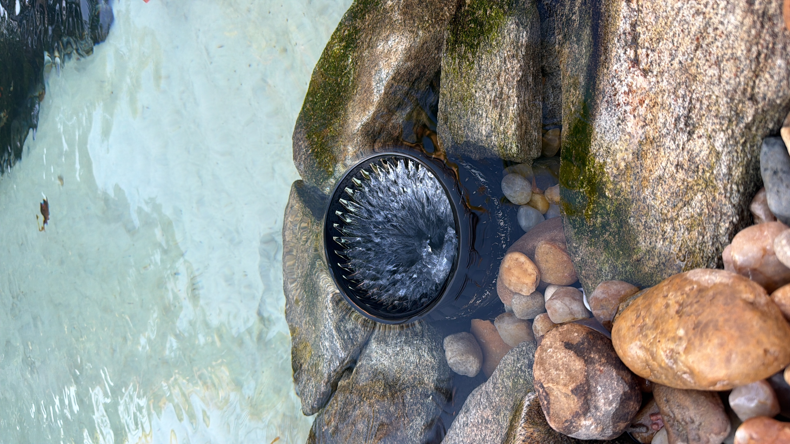

# pond-skimmer

Skimmer de lago impresso em 3D para **cano de PVC de esgoto de 150 mm**
(externo 149–151, interno 143–145, parede 3 mm), com **barreira de peixes de
3 mm** e cesto removível. Tudo é gerado por script paramétrico em Python
(`manifold3d`), sem CAD manual.

> O ponto de partida foi um "Pond skimmer" para cano de 110 mm publicado no
> MakerWorld (arquivo `.3mf`, só malhas). O conceito — corpo ranhurado + cesto
> interno removível — é dele; a geometria aqui é toda nova. O `.3mf` original
> não está neste repo.



*A v1 instalada: a água passa por cima da coroa. Foi o que ensinou a lição de
hidráulica descrita em [docs/DISCOVERY.md](docs/DISCOVERY.md).*

## Peças (estado atual)

| Arquivo | O que é | Status |
|---|---|---|
| `stl/corpo150_turbo.stl` | Corpo: saia de centragem dentro do cano, flange na borda, **coroa de 80 mm com 80 fendas de 3 mm** (55% do perímetro aberto), 2 anéis de travamento, parede 4 mm | **impresso** (ABS) |
| `stl/cesto150_v3.stl` | Cesto: fendas de 2 mm, fundo em cone "raios de sol", botão; pendura pelo topo da coroa em **3 pilares com abinha** | **impresso** (PLA, provisório) |
| `stl/cesto150_v4.stl` | Cesto: igual ao v3 mas **sem pilares** — assenta num cone de 13° que casa com o chanfro interno da saia; nada acima da borda do cano | para reimprimir em **PETG** |

Alternativa (plano B, não impressa): `scripts/skimmer150_v2.py` gera a
"cerca de peixes" — cerca ranhurada de Ø191 **ao redor** do cano, deixando a
borda do cano como vertedouro livre. Nível igual ao de antes do skimmer.

## Como funciona

```
        ┌──── coroa (fendas 3 mm, 80 mm de altura) ────┐
        │                                              │
 água ──┼─►  fendas  ──►  cai no cesto  ──►  fendas 2 mm  ──►  cano  ──►  bomba
        │              (fundo cone + parede)           │
 ═══════╪═══════ nível ≈ borda do cano + 3 cm ═════════╪═══════
        └─ flange apoiada na borda; saia de Ø136–142 entra no cano e centraliza ─┘
```

- **Quem passa pela coroa (≤ 3 mm) fica no cesto** (fendas de 2 mm): peixe
  miúdo aparece vivo na limpeza em vez de ir parar na bomba.
- O nível do lago é definido pelo **perímetro aberto na linha d'água** — não
  pela altura da coroa. Ver DISCOVERY.

## Impressão

| Peça | Orientação | Suporte | Notas |
|---|---|---|---|
| Corpo | **de cabeça pra baixo** (topo da coroa na mesa), brim 5 mm | não | 80 torres finas: PETG/ABS com câmara fechada; ≥3 perímetros |
| Cesto v3 / v4 | **em pé** (fundo na mesa), brim 5 mm | **não** | cone a 45°, botão com chanfro, abinhas do v3 têm 2,7 mm de balanço — imprime |

Material: **PETG** (ideal) ou ABS. PLA aguenta semanas/meses em água de lago,
mas é quebradiço. 6 perímetros no cesto deixam os pilares maciços.

## Instalação

1. Encaixe o corpo com a saia dentro do cano até a flange apoiar na borda.
   Nenhuma fixação: a saia (Ø142 no topo) centraliza; folga de 0,5–1,5 mm.
2. Desça o cesto pelo centro da coroa. v3: as 3 abinhas descansam no topo da
   coroa (qualquer ângulo). v4: desce ~1,3 mm e assenta no chanfro da saia.
3. Limpeza: puxe pelo botão. O corpo sai do cano só de levantar.

## Regenerar / modificar

```bash
python3 -m venv venv && ./venv/bin/pip install -r requirements.txt
cd stl && ../venv/bin/python ../scripts/skimmer150.py      # corpo + cesto v3 + v4
cd stl && ../venv/bin/python ../scripts/skimmer150_v2.py   # plano B (cerca)
../venv/bin/python ../tools/check_fit.py corpo150_turbo.stl cesto150_v4.stl
```

Todas as dimensões são constantes no topo de cada script. `tools/check_fit.py`
faz o que sempre foi feito antes de entregar um STL: corpo único e estanque,
colisão cesto × corpo (assentado e durante a inserção), altura de assento,
perímetro aberto na linha d'água, e um corte em PNG.

**Regras aprendidas na prática** (detalhes em `docs/DISCOVERY.md`):

- `Manifold.cylinder(h, r_baixo, r_topo)` — o cone invertido foi o bug mais
  repetido do projeto.
- Sólidos que só se tocam num plano **não** se fundem: sempre um anel de
  solda com sobreposição volumétrica.
- Corte inclinado precisa alcançar fundo (r pequeno) pra cobrir a parede
  curva — e depois ser **confinado** ao anel da parede, senão morde o cone.
- Anel apoiado em pilares = anel no ar = não imprime. Cada pilar termina na
  sua própria aba.
- Toda peça nova passa pelo `check_fit.py` contra o corpo **impresso**.

## Histórico

| Versão | Ideia | Resultado |
|---|---|---|
| v1 | coroa de 55 mm com 36 fendas de 3 mm + banda giratória no cesto pra regular 0–3 mm | vertedouro equivalente de ~85 mm (cano nu: 450) → água subiu 45+ mm e passou por cima |
| v2 | cerca de Ø191 ao redor do cano, vertedouro original intacto | correta hidraulicamente; peça grande e diferente — plano B |
| turbo | mesma cara da v1: 80 fendas, costelas de 2,4 mm, sem banda, coroa 80 mm | ~248 mm de vertedouro → nível ~3 cm acima da borda (cano nu ~2 cm) — **impressa** |
| cesto v3 | 3 pilares com abinha no topo da coroa (imprime sem suporte) | impresso em PLA |
| cesto v4 | assenta no chanfro da saia; nada acima da borda | pronto pra PETG |
