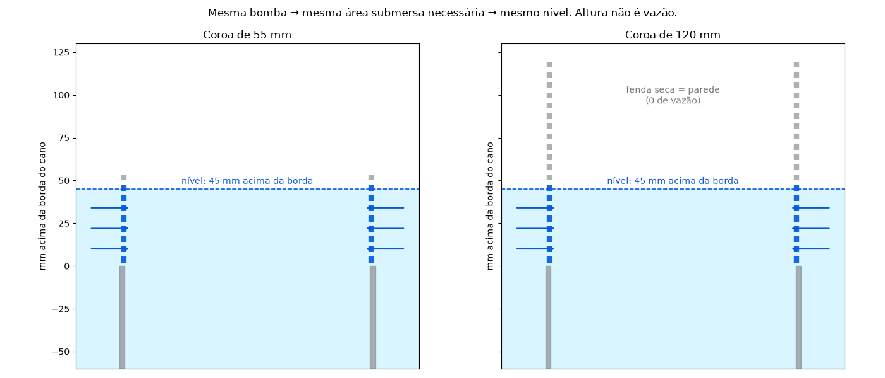

<h1 align="center">pond-skimmer</h1>

<p align="center">
  Skimmer de lago impresso em 3D para cano de PVC de esgoto de <b>150 mm</b>,<br>
  com <b>barreira de peixes de 3 mm</b>, cesto removível e vazão de verdade.<br>
  100% gerado por script paramétrico em Python — sem CAD manual.
</p>

<p align="center">
  <br>
  <sub><b>v2.3</b> (atual) — corpo com anel de assento interno a 45° e cesto de 72 fendas. z = 0 é a borda do cano. Figuras geradas dos STLs por <code>tools/render.py</code>.</sub>
</p>

<p align="center">
  <a href="#-começando">Começando</a> ·
  <a href="#-como-funciona">Como funciona</a> ·
  <a href="#-peças-e-versões">Peças e versões</a> ·
  <a href="#-impressão">Impressão</a> ·
  <a href="#-instalação-e-uso">Instalação</a> ·
  <a href="#-a-física-em-um-parágrafo">A física</a> ·
  <a href="#-modificar-e-regenerar">Modificar</a> ·
  <a href="docs/DISCOVERY.md">Discovery</a> ·
  <a href="CHANGELOG.md">Changelog</a>
</p>

---

## 🚀 Começando

Quer só imprimir? Pegue o **par** de uma pasta em `stl/` — corpo e cesto de
versões diferentes **não** encaixam.

| Quero… | Pasta | Arquivos | Material |
|---|---|---|---|
| a versão definitiva (atual) | [`stl/v2.3-petg-45-folga/`](stl/v2.3-petg-45-folga/) | `corpo150_v2.3.stl` + `cesto150_v2.3.stl` | PETG |
| reproduzir o que está no lago hoje | [`stl/v1.0-instalado/`](stl/v1.0-instalado/) | `corpo150_turbo.stl` + `cesto150_v3.stl` | ABS + PLA |

Configurações de impressão em [Impressão](#-impressão). Nenhuma peça usa
suporte.

## 💧 Como funciona

O cano de 150 mm é o dreno do lago: o nível da água fica na borda dele. O
skimmer encaixa **por dentro** do cano e apoia um aro na borda — nada sobe o
nível por construção. Acima da borda fica uma coroa ranhurada; dentro do
cano, um cesto removível.

```
                    ┌───────── coroa: 80 fendas × 3 mm, 80 mm ─────────┐
                    │  ~55% do perímetro aberto = 250 mm de vertedouro │
  lago ──► fendas ──┼──► cai no cesto ──► fendas de 2 mm ──► cano ──► bomba
                    │     (parede + fundo em cone)                     │
  ═══════ nível ≈ borda + 3 cm ═════════════════════════════════════════
                    └── aro apoiado na borda · saia Ø136→142 centraliza ──┘
```

- **Peixe**: o vão de 3 mm da coroa barra tudo que não seja alevino. O que
  passa (≤ 3 mm) cai num cesto de fendas de **2 mm** — fica preso **vivo**
  até a limpeza, em vez de seguir pro rotor da bomba.
- **Folhas e sujeira**: ficam na coroa (fendas diagonais soltam detrito) ou
  no cesto. Limpar = puxar o cesto pelo botão.
- **Nível**: definido pelo perímetro aberto na linha d'água, e só por ele.
  Com a bomba do lago (~2–3 L/s) o nível fica ~3 cm acima da borda, contra
  ~2 cm do cano nu. Ver [a física](#-a-física-em-um-parágrafo).

## 📦 Peças e versões

Os STLs vivem em **pastas por versão — uma por pedido, imutáveis**; cada
pasta é um conjunto fechado, com README próprio. Visão geral em [`stl/README.md`](stl/README.md), detalhes em
[`CHANGELOG.md`](CHANGELOG.md), e o que está fisicamente instalado (com
SHA-256) em [`docs/IMPRESSO.md`](docs/IMPRESSO.md).

| Versão | Corpo | Cesto | Como o cesto se apoia | Status |
|---|---|---|---|---|
| **v2.3** `stl/v2.3-petg-45-folga/` | coroa turbo + **anel de assento a 45°** interno | borda a 45°, **72 fendas** de 2 mm (43% aberta), colar com 0,7 mm de folga | borda encosta no anel: batente positivo, autocentra, não trava | **atual** — imprimir em PETG |
| v2.0 → v2.2 | idem (v2.2: prateleira reta) | 36 → 72 fendas; colar 0,2–0,6 → 0,7 mm | — | superadas; ver `stl/README.md` |
| **v1.0** `stl/v1.0-instalado/` | coroa turbo (chanfro no furo da saia) | **v3**: 3 pilares com abinha, 36 fendas | abinhas no topo da coroa | **no lago** (ABS + PLA), tag `v1.0-instalado` |
| v1.0 alternativa | — | **v4**: sem pilares | cone de 13° no chanfro da saia (trava, tipo cone Morse) | encaixa no corpo v1.0; não impresso |

<p align="center">
  <br>
  <sub>v1.0 (o que está no lago): corpo turbo com chanfro no furo e cesto v4 no corte.</sub>
</p>

<p align="center">
  <br>
  <sub>v1.0: cesto v3 (pilares com abinha, o que está impresso) e v4 (assenta no chanfro).</sub>
</p>

**O que é igual em todas**: coroa de 80 mm com 80 fendas de 3 mm inclinadas
a 20°, costelas de ~2,4 mm, parede de 4 mm, 2 anéis de travamento; saia
cônica Ø136→142 que entra no cano e centraliza; aro Ø158 apoiado na borda
com canais de entrada no nível da borda; cesto com fundo em cone "raios de
sol" (72 fendas de 2 mm) e botão central pra puxar.

## 🖨️ Impressão

| Peça | Orientação | Brim | Suporte | Perímetros | Notas |
|---|---|---|---|---|---|
| Corpo (qualquer versão) | **de cabeça pra baixo** — topo da coroa na mesa | 5 mm | **não** | ≥ 3 | 80 torres finas de 2,4 mm: câmara fechada ajuda; os anéis de travamento amarram as torres. Na v2.x o anel de assento vira um balanço de 45° |
| Cesto (todas as versões) | **em pé** — fundo na mesa | 5 mm | **não** | 6 | cone a 45°, botão com cone de 45° sob a cabeça; abinhas do v3 têm 2,7 mm de balanço |

**Material**: PETG é o ideal (água + sol). ABS também é definitivo. PLA
aguenta semanas/meses em água de lago, mas é quebradiço — serve de
provisório. Se o slicer oferecer suporte automático, **recuse**: ele planta
árvores de 8 cm dentro do cesto pra segurar balanços de 2 mm.

## 🔧 Instalação e uso

1. **Corpo**: desce com a saia dentro do cano até o aro apoiar na borda. Sem
   fixação — a saia (Ø142 na borda) centraliza com 0,5–1,5 mm de folga.
2. **Cesto**: desce pelo centro da coroa. v2.x assenta a borda de 45° no anel
   interno (autocentra); v3 apoia as 3 abinhas no topo da coroa, em qualquer
   ângulo.
3. **Limpeza**: puxa o cesto pelo botão, sacode, volta. A coroa se limpa
   passando a mão; o corpo sai do cano só de levantar.
4. **Nível subindo com o tempo** = fendas entupindo. Com 30% tapadas o nível
   sobe ~25%.

## 📐 A física em um parágrafo

O cano nu é um vertedouro de 450 mm de perímetro. Tudo que se põe na boca
dele reduz o perímetro **aberto na linha d'água**, e é só isso que define o
nível: `Q ≈ 1,7 · L · h^1,5`. A primeira versão tinha fendas de 3 mm a cada
12 mm mais uma banda no cesto — sobraram 85 mm de vertedouro e a água subiu
mais de 55 mm, passando por cima. **Altura da coroa não ajuda** (fenda seca é
parede) e **grade é pior que fenda** (paga barra nas duas direções). O que
ajuda: costela mais fina (80 fendas, 2,4 mm) e tirar o que estiver atrás das
fendas (a banda do cesto). Resultado: ~250 mm de vertedouro.

<p align="center">
  
</p>

A história completa, com os erros, está em [`docs/DISCOVERY.md`](docs/DISCOVERY.md).

## 🛠️ Modificar e regenerar

Tudo é gerado por [`scripts/skimmer150.py`](scripts/skimmer150.py) com
[`manifold3d`](https://github.com/elalish/manifold) + `trimesh`. As
dimensões são constantes no topo do arquivo; STL nunca é editado à mão.

```bash
python3 -m venv venv && ./venv/bin/pip install -r requirements.txt
./venv/bin/python scripts/skimmer150.py           # gera TODAS as pastas de stl/ (tabela VERSIONS no fim do script)
./venv/bin/python tools/check_fit.py stl/v2.3-petg-45-folga/corpo150_v2.3.stl stl/v2.3-petg-45-folga/cesto150_v2.3.stl
./venv/bin/python tools/render.py                 # figuras de docs/images
```

[`tools/check_fit.py`](tools/check_fit.py) é o que roda antes de qualquer
STL sair do repo: peça única e estanque, colisão cesto × corpo assentado e
durante a inserção, altura em que o cesto assenta, perímetro aberto na linha
d'água e um corte em PNG.

Regras que custaram impressões (detalhes no Discovery):

- `Manifold.cylinder(h, r_base, r_topo)` — cone invertido foi o bug mais repetido.
- `CrossSection` sempre **anti-horário**; horário vira furo e o manifold sai vazio.
- Sólidos que só se tocam num plano não se fundem: sempre um anel de solda.
- Corte inclinado precisa ir fundo pra cobrir a parede curva — e depois ser
  **confinado** ao anel da parede, senão morde o cone do fundo.
- Anel apoiado em pilares = anel no ar = não imprime.
- Toda peça nova passa pelo `check_fit.py` contra o corpo do **par**.

## 🗂️ Layout do repo

```
scripts/skimmer150.py     fonte de verdade; tabela VERSIONS = uma pasta por versão
stl/<versão>/             STLs gerados + README do conjunto (pastas imutáveis)
tools/check_fit.py        verificação de encaixe e vazão
tools/render.py           figuras de docs/images a partir dos STLs
docs/DISCOVERY.md         diário: hidráulica, peixes, CSG, impressão
docs/IMPRESSO.md          o que está no lago, com SHA-256
CHANGELOG.md              versões
CLAUDE.md                 regras pra sessões de Claude Code
```
