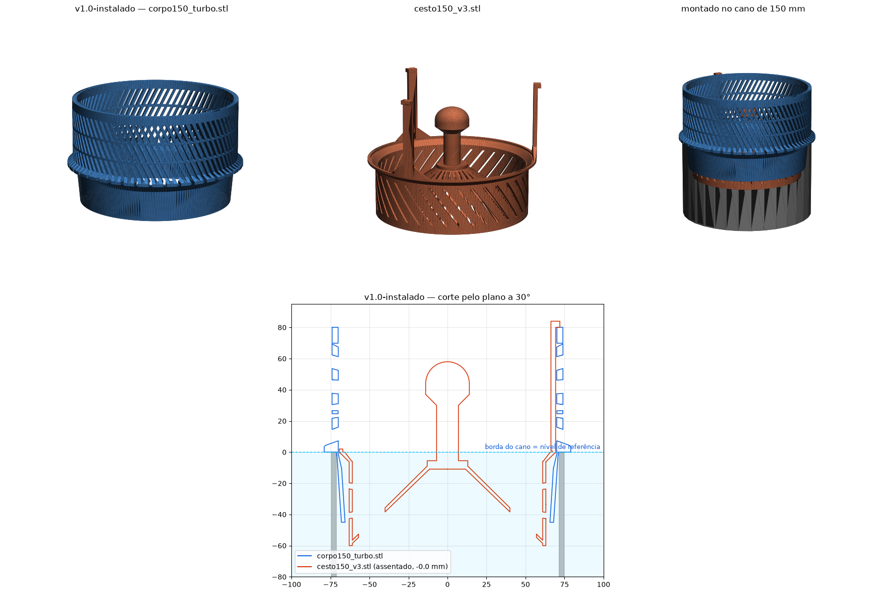
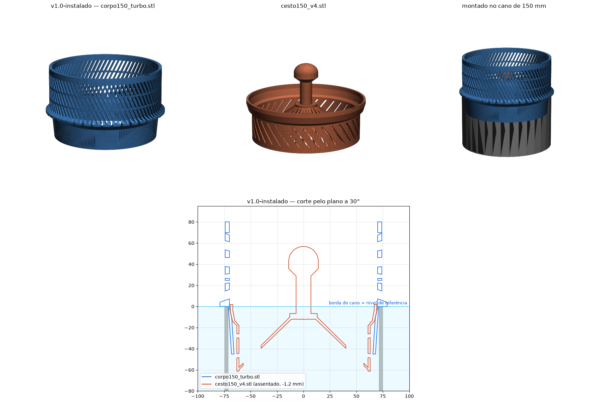

# v1.0 — instalado no lago

| Arquivo | Peça | Material | Notas |
|---|---|---|---|
| `corpo150_turbo.stl` | corpo | **ABS**, impresso 2026-09-03 | coroa 80 mm, 80 fendas × 3 mm a 20°, parede 4 mm, 2 anéis, saia Ø136→142 com chanfro interno de 13°. **Não alterar**: é a referência de encaixe dos cestos desta pasta |
| `cesto150_v3.stl` | cesto | **PLA** (provisório), impresso 2026-09-04 | 3 pilares 8×3 mm com abinha no topo da coroa; 36 fendas × 2 mm; fundo em cone; botão |
| `cesto150_v4.stl` | cesto (alternativa) | não impresso | assenta no chanfro de 13° da saia, nada acima da borda; o cone raso trava — funciona, mas pede um puxão pra sair |

Impressão: corpo de cabeça pra baixo com brim; cestos em pé com brim; sem
suporte; ≥3 perímetros (6 no cesto).

SHA-256 dos arquivos impressos em [docs/IMPRESSO.md](../../docs/IMPRESSO.md).
Tag git: `v1.0-instalado`.

## Preview

