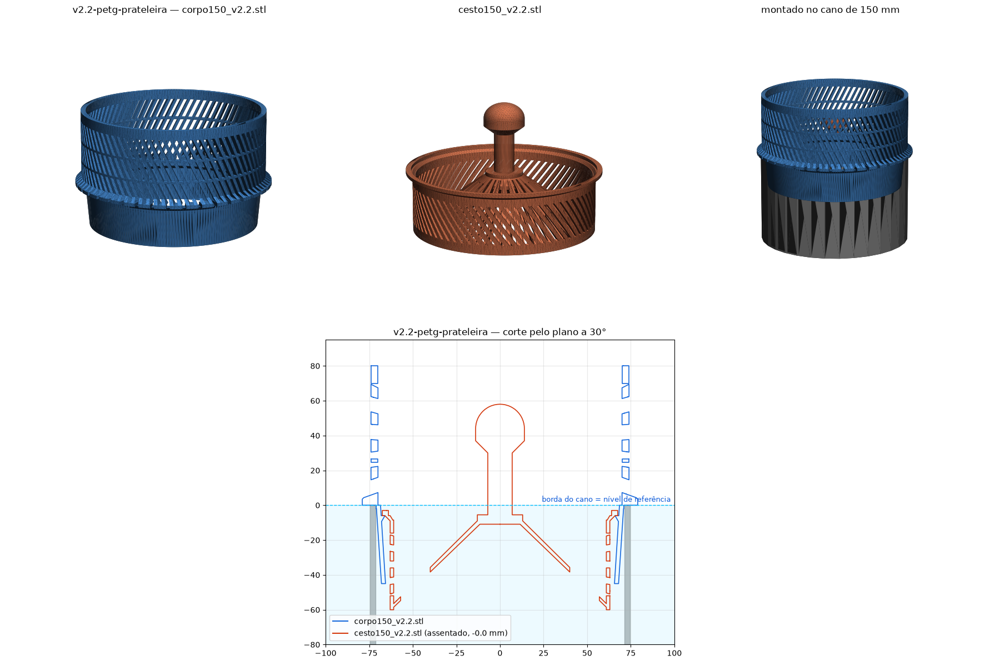

# v2.2-petg-prateleira — assento em prateleira reta (superada)

Pedido: "chanfro de suporte mais fácil de imprimir — parte de baixo sobe
inclinado, parte de cima reta". Também abriu a folga do colar.

| Arquivo | Peça | Notas |
|---|---|---|
| `corpo150_v2.2.stl` | corpo | coroa turbo + **prateleira** dentro da saia: topo reto em z −6 (2,2 mm), parte de baixo a 60° até a parede |
| `cesto150_v2.2.stl` | cesto | colar reto Ø135 (folga 0,7 mm) que apoia na prateleira; 72 fendas |

Funciona e imprime (o topo reto vira um balanço de uma camada de 2,2 mm na
impressão invertida). O dono preferiu voltar ao anel de 45°, que na
impressão de ponta-cabeça já era "base inclinada, topo reto".
Superada por [`v2.3-petg-45-folga`](../v2.3-petg-45-folga/).

## Preview

