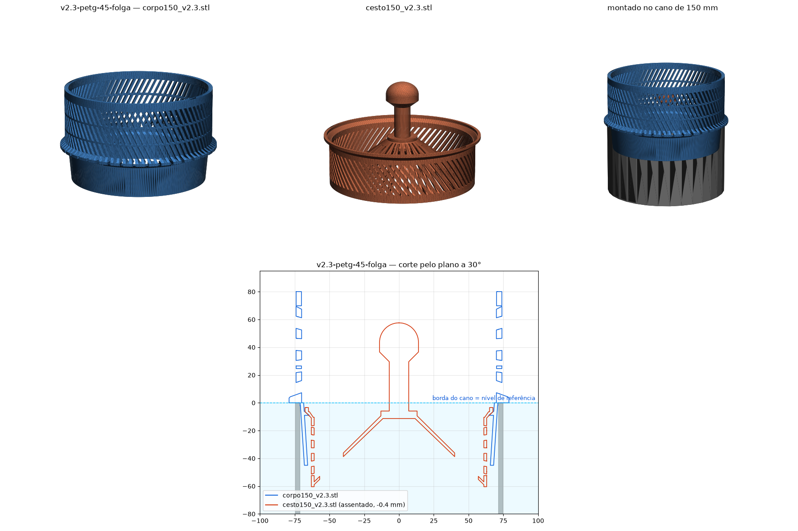

# v2.3-petg-45-folga — conjunto PETG atual

Pedido: "a versão de antes tava boa — fecha a versão boa". Anel de 45° de
volta, mantendo a folga de 0,7 mm no colar que a v2.2 trouxe.

| Arquivo | Peça | Notas |
|---|---|---|
| `corpo150_v2.3.stl` | corpo | coroa turbo (80 fendas × 3 mm, 80 mm, parede 4 mm, 2 anéis) + **anel de assento a 45°** dentro da saia (z −9 a −4,8; r 64,5 → 68,7); sem o chanfro do furo |
| `cesto150_v2.3.stl` | cesto | borda a 45° que assenta no anel (batente positivo, autocentrante, não trava); colar Ø135 com **0,7 mm de folga**; topo em z −3 (nada acima da borda do cano); **72 fendas** de 2 mm na parede (43% aberta); fundo em cone com 72 fendas; botão |

**Só encaixam um no outro.** O cesto não tem apoio no corpo da v1.0.

Impressão (PETG, Bambu P1S): corpo de cabeça pra baixo com brim — o anel de
assento vira um balanço de 45°; cesto em pé com brim, 6 perímetros; suporte
**desligado** nos dois.

Verificado: 1 corpo cada, 0 colisões assentado e em +20/+50 mm, assenta no
anel com 0,4 mm de acomodação, 52% do perímetro aberto (240 mm de vertedouro).

Ao instalar: atualizar `docs/IMPRESSO.md` e criar a tag `v2.3-instalado`.

## Preview

